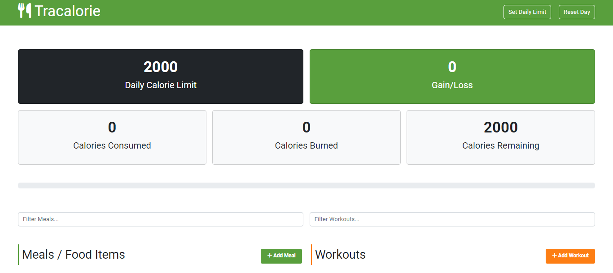

# Tracalorie

## A Single Page Application (SPA) in Vanilla JavaScript

**Author:** Afzal M  
**Date:** September 2023

 &nbsp;&nbsp;&nbsp;&nbsp; 

### Description

Tracalorie is a Single Page Application (SPA) developed in Vanilla JavaScript, showcasing the implementation of Object-Oriented Programming (OOP) principles in JavaScript.

### Deployment

Visit the deployed version of Tracalorie at. &nbsp;[**https://tracaloriev1.netlify.app**](https://tracaloriev1.netlify.app).

### Features

- **Object-Oriented Programming (OOP):** This project was created as part of the learning process for OOP in JavaScript, demonstrating the application of best practices in code organization and design.

### Screenshots

### Technologies Used

- **Vanilla JavaScript:** The core functionality of Tracalorie is implemented using pure JavaScript, showcasing the ability to create dynamic and interactive user interfaces without relying on frameworks or libraries.

- **Bootstrap:** The project utilizes Bootstrap for a responsive and visually appealing design. Bootstrap components enhance the overall user experience.

- **Git:** Version control is managed using Git, providing a robust history of changes and collaboration.

### How to Run Locally

To run Tracalorie locally, follow these steps:

1. Clone the repository

2. Run in your preffered local web server
